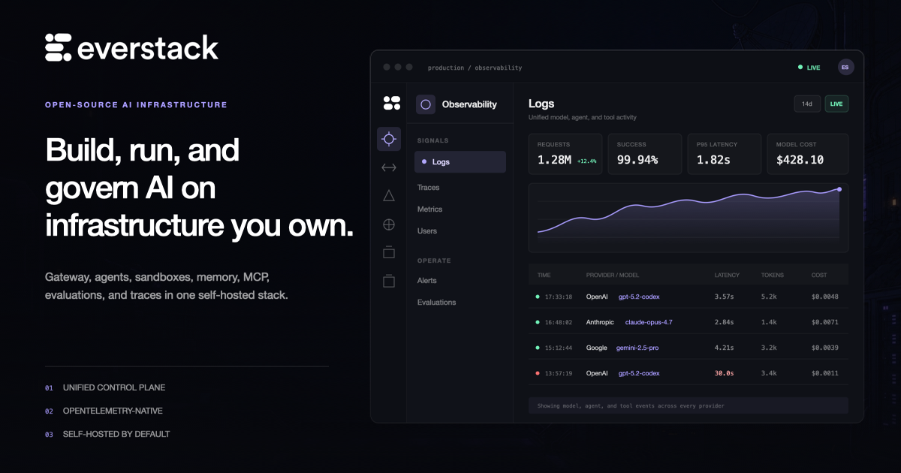
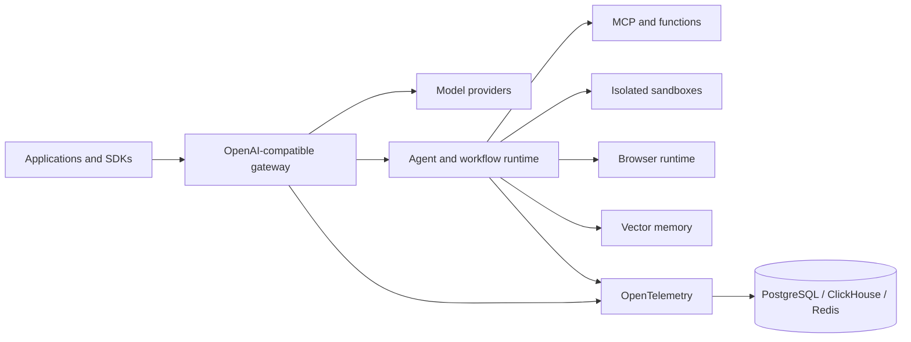

<div align="center">
  <h1>Everstack</h1>

  <hr />

  <p><strong>The open-source control plane for production AI.</strong></p>
  <p>
    Route models, run durable agents, execute code in isolated sandboxes,
    connect tools and memory, and trace every step on infrastructure you control.
  </p>

  <p>
    <a href="https://github.com/everstacklabs/everstack/actions/workflows/ci.yml"></a>
    <a href="https://opensource.org/licenses/Apache-2.0"></a>
    <a href="https://github.com/everstacklabs/everstack/releases"></a>
    <a href="https://github.com/everstacklabs/everstack/stargazers"></a>
    <a href="./go.mod"></a>
  </p>

  <p>
    <a href="https://everstack.ai">Website</a> ·
    <a href="https://docs.everstack.ai">Documentation</a> ·
    <a href="#local-quickstart">Quickstart</a> ·
    <a href="#platform-capabilities">Platform</a> ·
    <a href="#architecture">Architecture</a> ·
    <a href="./ROADMAP.md">Roadmap</a> ·
    <a href="./CONTRIBUTING.md">Contributing</a>
  </p>

  <br />

  <a href="https://everstack.ai">
    
  </a>
</div>

## What is Everstack?

Everstack is a self-hosted AI infrastructure platform that brings the gateway,
runtime, execution, data, and operations layers of production AI into one
system. Applications use an OpenAI-compatible API while Everstack handles
provider routing, agent sessions, isolated execution, memory, tools,
evaluations, and telemetry behind it.

Teams commonly assemble these capabilities from separate gateways, agent
frameworks, sandbox vendors, vector databases, workflow engines, and
observability products. Everstack provides a shared control plane and a single
operational boundary while keeping models, data, and infrastructure under your
control.

Use Everstack with an existing application or agent framework, or build directly
against its Connect/gRPC APIs and generated SDKs.

## Local quickstart

Requirements: Docker with Compose v2, 6 GB of memory, and port `8089`. The
first source build can take several minutes; later builds reuse Docker caches.

```bash
git clone https://github.com/everstacklabs/everstack.git
cd everstack
docker compose -f examples/quickstart/compose.yaml up -d --build
curl --fail --retry 30 --retry-delay 2 http://localhost:8089/debug/healthz
```

Open [http://localhost:8089](http://localhost:8089), then:

1. Add a model-provider key under **Vault -> LLM Providers**.
2. Create an Everstack API key under **Vault -> API Keys**.
3. Send a request through the OpenAI-compatible gateway.
4. Inspect the resulting logs, traces, latency, tokens, and provider cost in **Observability**.

```bash
export EVERSTACK_API_KEY="replace-with-your-everstack-api-key"

curl --fail-with-body http://localhost:8089/v1/chat/completions \
  -H 'content-type: application/json' \
  -H "x-mf-api-key: $EVERSTACK_API_KEY" \
  -d '{
    "model": "gpt-4o-mini",
    "messages": [{"role": "user", "content": "Say hello from Everstack"}]
  }'
```

See the [complete local quickstart](./examples/quickstart/README.md) for
shutdown, troubleshooting, configuration, and production-safety notes.

When you bring a provider key, that provider bills inference directly and the
Everstack model-usage charge is **$0**. Token counts and estimated provider cost
remain available as observability data.

## Platform capabilities

| Layer | What it provides |
| --- | --- |
| **AI gateway** | OpenAI-compatible APIs, 17+ provider adapters, routing, fallback, load balancing, key rotation, semantic caching, and rate limits |
| **Agent runtime** | Stateful sessions, streaming, approvals, child-agent spawning, skills, triggers, and deploy-as-API |
| **Isolated execution** | Docker, Firecracker, and Kubernetes backends with shell, files, network policy, resource controls, and lifecycle management |
| **Browser automation** | Browser sessions, screenshots, action events, navigation, and isolated execution |
| **Memory** | PgVector, Qdrant, Pinecone, and Weaviate vector-memory backends |
| **MCP and tools** | MCP server registration, tool discovery, federated tool calling, and serverless functions |
| **Workflows** | Visual DAG pipelines for agents, tools, API calls, approvals, and scheduled or event-driven work |
| **Observability** | OpenTelemetry-native traces, metrics, structured logs, model latency, token usage, provider cost, and alerts |
| **Evaluations** | Datasets, scoring, LLM judges, evaluation runs, reviews, and regression analysis |
| **Operator experience** | Embedded React admin application, `evs` CLI, Connect/gRPC APIs, OpenAPI specifications, and generated SDKs |

## What you can build

- A multi-provider model gateway with routing, retries, fallback, caching, and usage controls.
- Durable agents with sessions, tools, memory, approvals, child agents, and API deployments.
- Secure code-execution products backed by Docker, Firecracker microVMs, or Kubernetes.
- Retrieval and long-term memory systems that can move between supported vector stores.
- MCP-powered tool platforms with centralized discovery, policy, and execution.
- AI workflows that combine agents, functions, webhooks, schedules, and human checkpoints.
- Evaluation and observability pipelines that connect application behavior to traces, scores, latency, tokens, and cost.
- Self-hosted AI products that need a unified data and infrastructure boundary.

## How the pieces fit together

An application talks to one gateway. The gateway resolves a provider route,
enforces policy, and records telemetry. Agent and workflow runs can call MCP
tools, functions, memory, browsers, and isolated sandboxes. Every layer emits
OpenTelemetry data into the shared operations surface.

```text
Your application or agent framework
                 |
                 v
      OpenAI-compatible gateway
      routing | fallback | cache
                 |
        +--------+--------+
        |                 |
        v                 v
  Model providers    Agent runtime
                          |
             +------------+------------+
             |            |            |
             v            v            v
          Memory       MCP/tools    Sandboxes
                                      |
                              Docker | Firecracker | K8s

        Traces | metrics | logs | evals | alerts
```

## Architecture



The gateway and admin application ship together. PostgreSQL stores operational
state, ClickHouse stores high-volume telemetry, and Redis supports caching and
rate limiting. Configuration is layered from embedded defaults, a YAML file,
and `EVS_` environment variables.

Proto files under [`proto/everstack/`](./proto/everstack/) are the source of
truth for Connect/gRPC services, OpenAPI specifications, and generated clients.

## Deployment model

| Component | Responsibility | Typical placement |
| --- | --- | --- |
| **Gateway and admin** | API ingress, provider routing, control plane, embedded operator UI | One or more application nodes |
| **PostgreSQL** | Platform state, configuration, sessions, and metadata | Managed or self-hosted PostgreSQL |
| **ClickHouse** | Traces, logs, metrics, usage, and evaluation data | Managed or self-hosted ClickHouse |
| **Redis** | Cache, rate limits, and coordination | Managed or self-hosted Redis |
| **Sandbox backend** | Isolated code, tools, browsers, and jobs | Docker host, Firecracker hosts, or Kubernetes |
| **Telemetry export** | Optional downstream traces and metrics | Any OpenTelemetry-compatible backend |

The Docker Compose quickstart is intended for evaluation and development.
Production deployments should use durable databases, explicit secrets,
restricted network policy, backups, and the sandbox backend appropriate for
their isolation requirements.

## Repository layout

```text
everstack/
├── cmd/                  # evs CLI and gateway startup
├── internal/
│   ├── providers/        # model-provider adapters and routing
│   ├── agents/           # agent runtime, sessions, skills, and deployment
│   ├── sandbox/          # Docker, Firecracker, and Kubernetes execution
│   ├── memory/           # vector-memory interfaces and backends
│   ├── mcp/              # MCP registration, discovery, and tool calls
│   ├── workflows/        # workflow and DAG execution
│   ├── functions/        # isolated serverless functions
│   └── telemetry/        # OpenTelemetry instrumentation
├── apps/admin/           # self-hosted operator dashboard
├── packages/             # shared UI, API clients, proto clients, and SDKs
├── proto/everstack/      # API source of truth
├── model-catalog/        # provider and model metadata
└── examples/             # quickstarts and configuration examples
```

## Build from source

Requirements:

- Go 1.25+
- Node.js 20+
- pnpm 10.5.2
- Buf and the protobuf plugins installed by the Make target below

Build the Community Edition binary:

```bash
make install_grpc_dependencies
make core_api
go build -tags=ce -o ./evs .
```

Build the embedded admin UI and local binary:

```bash
make build-local
```

Useful development commands:

```bash
make core_apps
air serve --config ./examples/gateway_hybrid.yaml
go test ./...
pnpm check-types
pnpm build
```

See [CONTRIBUTING.md](./CONTRIBUTING.md) for the complete development workflow,
testing expectations, generated-code rules, and pull-request process.

## Extend Everstack

Everstack is designed around explicit extension points:

| Extension | Source |
| --- | --- |
| Model providers | [`internal/providers/`](./internal/providers/) |
| Sandbox backends | [`internal/sandbox/`](./internal/sandbox/) |
| Memory stores | [`internal/memory/`](./internal/memory/) |
| MCP integration | [`internal/mcp/`](./internal/mcp/) |
| API contracts | [`proto/everstack/`](./proto/everstack/) |
| Model metadata | [`model-catalog/`](./model-catalog/) |

Please open a
[design discussion](https://github.com/everstacklabs/everstack/discussions)
before introducing a new public interface or persistence contract.

## Releases and roadmap

- Stable releases are published through [GitHub Releases](https://github.com/everstacklabs/everstack/releases).
- Product direction and delivery status live in [ROADMAP.md](./ROADMAP.md).
- Upgrade notes and compatibility changes are documented with each release.
- Backward compatibility matters for self-hosted operators who cannot upgrade every deployment immediately.

## Editions

This repository is the Apache 2.0 Community Edition. Everstack Cloud operates
the managed control plane and infrastructure; commercial enterprise offerings
add deployment, governance, and support capabilities. Published Community
Edition files remain Apache 2.0.

See [EDITIONS.md](./EDITIONS.md) for the boundary and
[GOVERNANCE.md](./GOVERNANCE.md) for project decision-making.

## Community

- Ask usage and architecture questions in [GitHub Discussions](https://github.com/everstacklabs/everstack/discussions).
- Report reproducible bugs through [GitHub Issues](https://github.com/everstacklabs/everstack/issues).
- Read [SUPPORT.md](./SUPPORT.md) before requesting support.
- Contributions follow [CONTRIBUTING.md](./CONTRIBUTING.md) and the [Code of Conduct](./CODE_OF_CONDUCT.md).
- If Everstack is useful to your team, starring the repository helps other builders discover it.

## Security

Do not open public issues for suspected vulnerabilities. Report security
problems privately using the process in [SECURITY.md](./SECURITY.md).

Never include API keys, provider credentials, license keys, or customer data in
issues, discussions, traces, screenshots, or example configurations.

## License

Everstack Community Edition is licensed under the
[Apache License 2.0](./LICENSE).
