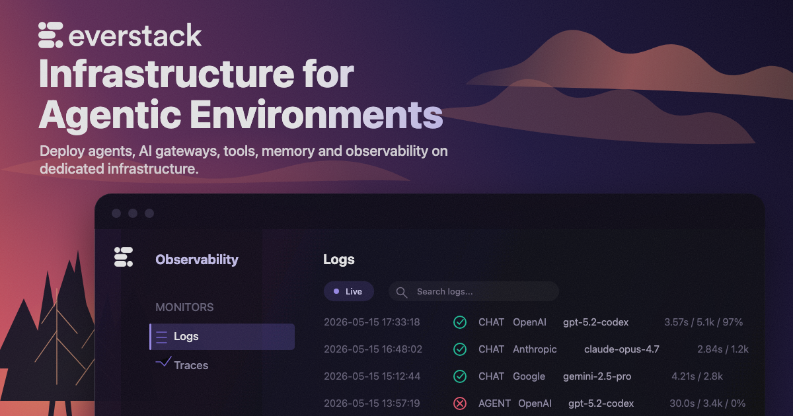
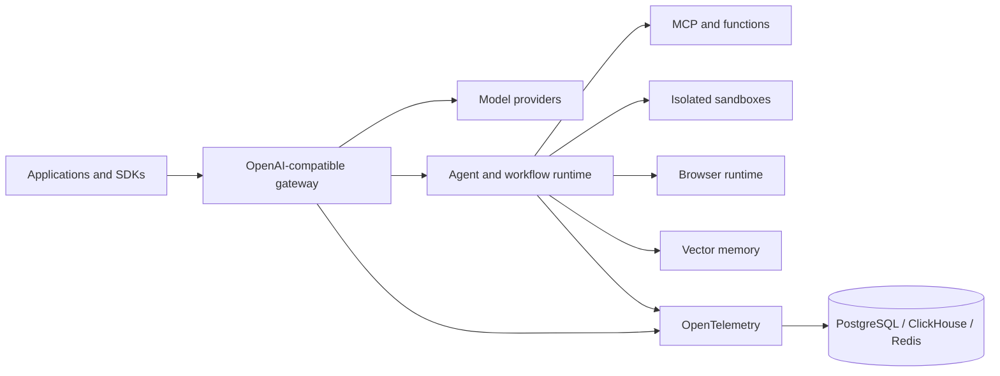

<div align="center">
  <a href="https://github.com/everstacklabs/everstack">
    
  </a>

  <br />

  <a href="https://github.com/everstacklabs/everstack">
    <picture>
      <source media="(prefers-color-scheme: dark)" srcset="assets/everstack-wordmark-light.png" />
      <source media="(prefers-color-scheme: light)" srcset="assets/everstack-wordmark-dark.png" />
      
    </picture>
  </a>

  <h1>Everstack</h1>

  <p><strong>Self-hosted runtime and control plane for production AI agents.</strong></p>
  <p>Run model routing, isolated execution, browser automation, workflows, MCP tools, memory, and end-to-end traces from one platform.</p>

  <p>
    <a href="https://github.com/everstacklabs/everstack/actions/workflows/ci.yml"></a>
    <a href="https://opensource.org/licenses/Apache-2.0"></a>
    <a href="https://github.com/everstacklabs/everstack/releases"></a>
    <a href="https://github.com/everstacklabs/everstack/stargazers"></a>
  </p>

  <p>
    <a href="https://docs.everstack.ai">Documentation</a> ·
    <a href="https://github.com/everstacklabs/everstack/discussions">Discussions</a> ·
    <a href="./ROADMAP.md">Roadmap</a> ·
    <a href="./CONTRIBUTING.md">Contributing</a>
  </p>
</div>

---

Most teams can prototype an agent. Shipping one safely means assembling an LLM
gateway, runtime, sandbox provider, browser service, workflow engine, memory,
telemetry, policy, and an operator UI. Everstack provides those layers as one
OpenAI-compatible, self-hosted platform.

> **Project status:** Everstack is pre-1.0. Expect active development and review
> release notes before upgrading production deployments.

## Local quickstart

Requirements: Docker with Compose v2, 6 GB of memory, and port `8089`. The
first source build can take several minutes; later builds reuse Docker caches.

```bash
git clone https://github.com/everstacklabs/everstack.git
cd everstack
docker compose -f examples/quickstart/compose.yaml up -d --build
curl --fail --retry 30 --retry-delay 2 http://localhost:8089/debug/healthz
```

Open [http://localhost:8089](http://localhost:8089), add a model-provider key
under **Vault → LLM Providers**, then create an Everstack API key under
**Vault → API Keys**.

```bash
export EVERSTACK_API_KEY="replace-with-your-everstack-api-key"

curl --fail-with-body http://localhost:8089/v1/chat/completions \
  -H 'content-type: application/json' \
  -H "x-mf-api-key: ${EVERSTACK_API_KEY}" \
  -d '{
    "model": "gpt-4o-mini",
    "messages": [{"role": "user", "content": "Say hello from Everstack"}]
  }'
```

See the [local quickstart](./examples/quickstart/README.md) for shutdown,
troubleshooting, and production-safety notes.

When you bring a provider key, that provider bills inference directly and the
Everstack model-usage charge is **$0**. Token counts and estimated provider cost
remain available as observability data.

## What is included

| Layer | Capabilities |
| --- | --- |
| **AI gateway** | OpenAI-compatible APIs, 17+ provider adapters, routing, fallback, load balancing, key rotation, caching, and rate limits |
| **Agent runtime** | Stateful sessions, streaming, approvals, child-agent spawning, triggers, and deploy-as-API |
| **Isolated execution** | Docker, Firecracker, and Kubernetes backends with shell, files, networking controls, and lifecycle management |
| **Browser automation** | Browser tools, screenshots, action events, and isolated browser sessions |
| **Workflows and tools** | Visual DAG workflows, serverless functions, MCP discovery, and federated tool calling |
| **Memory** | PgVector, Qdrant, Pinecone, and Weaviate vector-memory backends |
| **Observability and evals** | OpenTelemetry traces, metrics, logs, alerts, datasets, scores, and evaluation runs |
| **Operator experience** | Embedded React admin application, CLI, Connect/gRPC APIs, and generated SDKs |

## Architecture



The gateway and admin application ship together. Configuration is layered from
embedded defaults, a YAML file, and `EVS_` environment variables. Proto files
under [`proto/everstack/`](./proto/everstack/) are the source of truth for
Connect/gRPC and generated clients.

## Build from source

Requirements:

- Go 1.25+
- Node.js 20+
- pnpm 10.5.2
- Buf and the protobuf plugins installed by the Make target below

```bash
make install_grpc_dependencies
make core_api
go build -tags=ce -o ./evs .
```

To build the embedded admin UI as well:

```bash
make build-local
```

Development and testing commands are documented in
[CONTRIBUTING.md](./CONTRIBUTING.md).

## Add a provider or backend

Everstack is designed around explicit extension points:

- Provider adapters: [`internal/providers/`](./internal/providers/)
- Sandbox backends: [`internal/sandbox/`](./internal/sandbox/)
- Memory stores: [`internal/memory/`](./internal/memory/)
- MCP integration: [`internal/mcp/`](./internal/mcp/)
- API contracts: [`proto/everstack/`](./proto/everstack/)
- Model metadata: [`model-catalog/`](./model-catalog/)

Please open a design discussion before introducing a new public interface or
persistence contract.

## Editions

This repository is the Apache 2.0 Community Edition. Everstack Cloud operates
the managed control plane and infrastructure; commercial enterprise offerings
add deployment, governance, and support capabilities. Published Community
Edition files remain Apache 2.0.

See [EDITIONS.md](./EDITIONS.md) for the boundary and
[GOVERNANCE.md](./GOVERNANCE.md) for project decision-making.

## Community

- Ask usage and architecture questions in
  [GitHub Discussions](https://github.com/everstacklabs/everstack/discussions).
- Report reproducible bugs through
  [GitHub Issues](https://github.com/everstacklabs/everstack/issues).
- Read [SUPPORT.md](./SUPPORT.md) before requesting support.
- Report vulnerabilities privately as described in
  [SECURITY.md](./SECURITY.md).
- Contributions follow [CONTRIBUTING.md](./CONTRIBUTING.md) and the
  [Code of Conduct](./CODE_OF_CONDUCT.md).

If Everstack is useful to your team, starring the repository helps other
builders discover it.

## License

Everstack Community Edition is licensed under the
[Apache License 2.0](./LICENSE).
