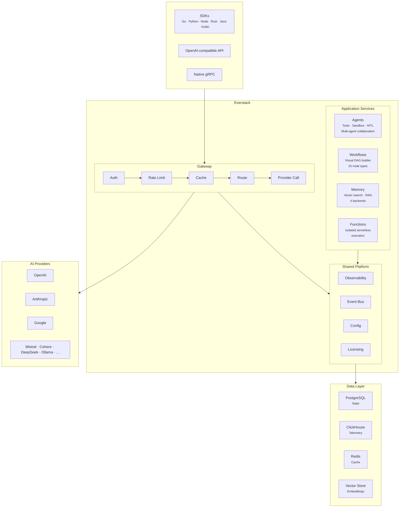
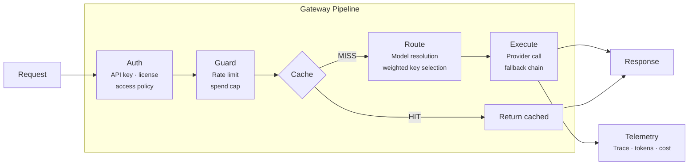
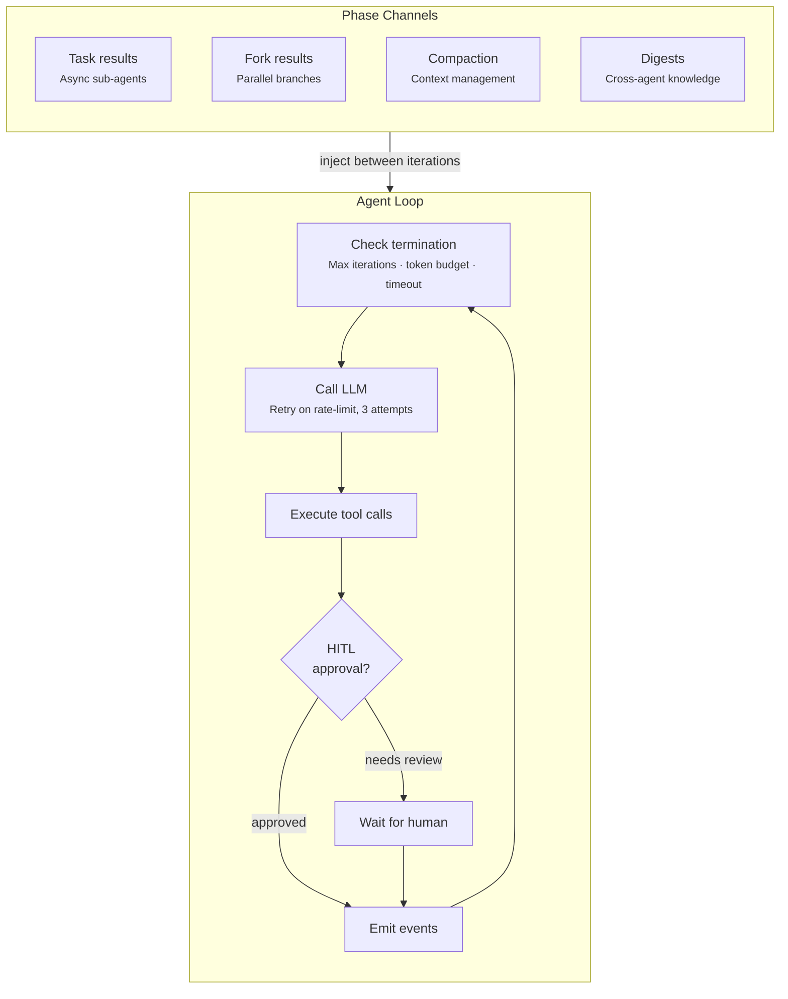
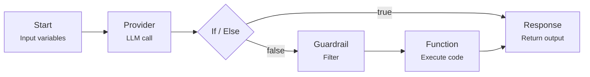
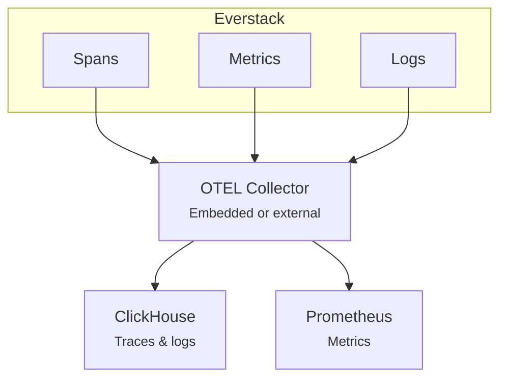

Everstack is a unified AI control plane. Rather than scattering LLM logic across services, it consolidates routing, governance, execution, and observability into a single platform that every team integrates against.

This page describes how the system is designed and how its components fit together.

## System Overview

Everstack is composed of seven subsystems. All share the same authentication, observability, and governance layer — there are no separate auth flows or siloed telemetry.

### Why This Shape

**Single binary** — The gateway, agents, workflows, memory, functions, and all APIs compile into one Go binary. You deploy one container, not a fleet of microservices. This reduces operational surface without sacrificing capability.

**Shared platform layer** — Every subsystem dispatches commands and emits events through the same event bus. An agent calling a function, a workflow querying memory, or a gateway request hitting cache all produce consistent telemetry and respect the same access controls.

**Dual database** — Transactional state (configs, keys, agent sessions) lives in PostgreSQL. High-volume telemetry (traces, logs, metrics) flows to ClickHouse. This separation lets you scale analytics independently and keep your operational database fast.

---

## Gateway

The gateway is the primary API surface. It accepts OpenAI-compatible requests and routes them to one of 17+ upstream LLM providers.

**Provider routing** — Each provider registers through a factory. At request time, the gateway selects a provider and API key based on model config, key weights, and real-time rate-limit state from Redis. If the primary provider fails, the fallback chain is evaluated automatically.

**Semantic cache** — Embeddings of recent requests are compared to incoming requests. Semantically similar queries return cached responses, saving both latency and provider cost.

**Hot-reload** — Gateway configuration (models, rate limits, providers) can be changed at runtime without restarts.

---

## Agents

Agents are long-running LLM sessions that can use tools, execute code, and collaborate with other agents. The runtime manages the conversation loop, tool dispatch, and context window automatically.

**Tool system** — Agents access two kinds of tools. _Custom tools_ are defined in the agent config or discovered from MCP servers. _Runtime tools_ are injected by the platform: sandbox execution, file I/O, git, web search, memory query/store, sub-agent spawning, and human-in-the-loop prompts.

**Four-phase execution** — The loop supports four opt-in phases that inject state between iterations:

| Phase          | What it does                                                                                                    |
| -------------- | --------------------------------------------------------------------------------------------------------------- |
| **Task queue** | Spawn sub-agents asynchronously. Results are injected when ready.                                               |
| **Forking**    | Split into parallel branches that execute independently and merge.                                              |
| **Monitoring** | Track token usage. When the context window fills, compact it in three tiers: summarize, prune, then hard-limit. |
| **Digestion**  | Summarize completed sessions into digests and broadcast them to related agents.                                 |

**Sandboxes** — Agents can create isolated environments to run code. Three backends are available: Docker containers (development), hardware-isolated sandboxes (production), and Kubernetes pods (enterprise). Each sandbox supports file I/O, git, shell access, port exposure, and cron scheduling.

---

## Workflows

Studio is a visual workflow builder. Workflows compile into a directed acyclic graph (DAG) and execute as a single API call.

Fifteen node types are available: Start, Provider (LLM call), Agent, Function, Memory, Cache, Load Balancer, If/Else, Router, Input Guardrails, Output Guardrails, Webhook, HTTP Request, Auth, and Response.

The engine traverses the graph with cycle detection, records every node execution in a ledger (timing, inputs, outputs), and routes along labeled edges. Workflows are versioned with preview and rollback support.

---

## Memory

The memory system provides vector-based semantic search for RAG. Documents are chunked, embedded via an LLM embedding model, and stored in one of four backends:

| Backend      | Best for                                    |
| ------------ | ------------------------------------------- |
| **PgVector** | Self-hosted, low-ops (PostgreSQL extension) |
| **Qdrant**   | High-performance, large-scale               |
| **Pinecone** | Managed, serverless                         |
| **Weaviate** | Hybrid search (vector + keyword)            |

At query time, the search text is embedded and matched against stored vectors using cosine, euclidean, or dot-product distance. Agents call memory automatically via the `memory_query` and `memory_store` tools.

---

## Observability

Every request, agent turn, workflow node, and function invocation produces telemetry via OpenTelemetry.

Beyond standard OTEL signals, Everstack adds:

| Signal                   | Description                                                         |
| ------------------------ | ------------------------------------------------------------------- |
| **Token counts**         | Input, output, and cached tokens on every LLM call                  |
| **Cost**                 | Per-request cost calculated from the model catalog's pricing        |
| **Scores**               | Custom quality or relevance scores you attach to any trace          |
| **Payload logging**      | Full request/response bodies (opt-in, disabled by default)          |
| **Provider attribution** | Every span maps to a specific provider and model for cost breakdown |

---

## Security and Governance

| Layer                  | Mechanism                                                                                       |
| ---------------------- | ----------------------------------------------------------------------------------------------- |
| **Authentication**     | API key validation on every request. Keys support rotation, revocation, and scoped permissions. |
| **Machine-to-machine** | Internal service calls are signed with device fingerprints and anti-replay nonces.              |
| **Spend control**      | Real-time budget enforcement. Spend limits and token caps are checked before any provider call. |
| **Rate limiting**      | Per-key, per-model, and global rate limits with state in Redis.                                 |
| **Encryption**         | API keys encrypted at rest. TLS for all traffic.                                                |
| **Data residency**     | Self-hosted mode: all data in your databases, nothing leaves your network.                      |
| **Payload privacy**    | Request/response bodies are never stored unless you opt in. Retention is configurable.          |
| **Audit**              | Every action is logged with user, timestamp, and correlation ID.                                |
| **License gating**     | Features are enforced per license tier. Unauthorized access is blocked at the middleware layer. |

---

## Data Architecture

| What                                              | Where                                       | Why                                                                        |
| ------------------------------------------------- | ------------------------------------------- | -------------------------------------------------------------------------- |
| Configs, API keys, agents, workflows, functions   | **PostgreSQL**                              | Transactional consistency, relational queries, encrypted key storage       |
| Traces, logs, telemetry events, metrics           | **ClickHouse**                              | Column-oriented, high-volume append, fast analytical queries               |
| Rate-limit state, semantic cache, session routing | **Redis**                                   | Sub-millisecond reads, ephemeral state, pub/sub for cross-instance routing |
| Document embeddings                               | **PgVector / Qdrant / Pinecone / Weaviate** | Nearest-neighbor search for RAG                                            |

You can run PostgreSQL alone for simpler deployments. Add ClickHouse when you need analytics at scale. Redis is optional but recommended for caching and rate limiting.

---

## Deployment

| Model           | What you run                                                       | Data location                      |
| --------------- | ------------------------------------------------------------------ | ---------------------------------- |
| **Self-hosted** | Single binary or Docker container + your databases                 | Everything on your infrastructure  |
| **Cloud**       | Managed by Everstack with multi-tenant isolation, SSO, and billing | Hosted with configurable retention |

Both modes use the same core binary. Configuration is via YAML files and environment variables (prefixed `EVS_`). Config changes are hot-reloaded without restarts.

---

## Where to Go Next

- [Quickstart](/getting-started/quickstart) — Get running in minutes
- [Configuration](/getting-started/configuration) — Config reference and environment variables
- [Providers](/getting-started/providers) — Connect your LLM providers
- [Gateway](/getting-started/gateway/overview) — Routing, caching, and rate limiting
- [Agents](/getting-started/agents/overview) — Build and manage autonomous agents
- [Studio](/getting-started/studio/overview) — Visual workflow builder
- [Memory](/getting-started/memory/overview) — Vector search and RAG
- [Observability](/getting-started/observability/overview) — Traces, logs, and metrics
- [Authentication](/getting-started/authentication) — Auth and access control
